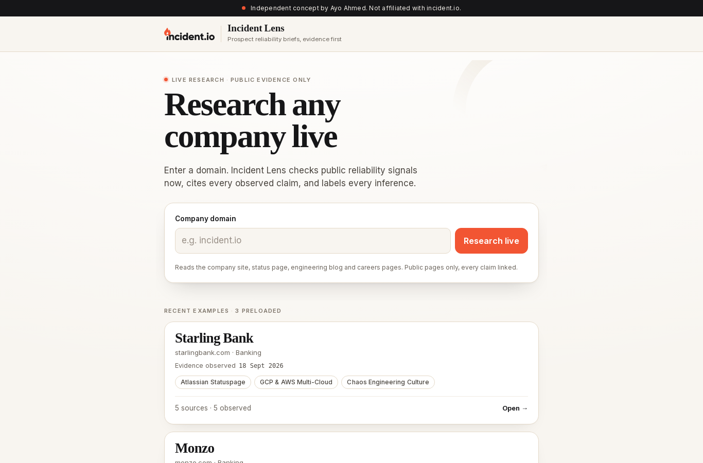
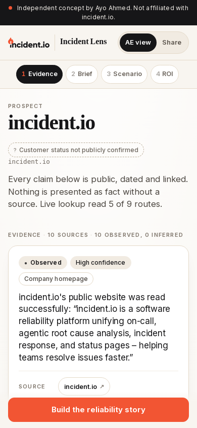
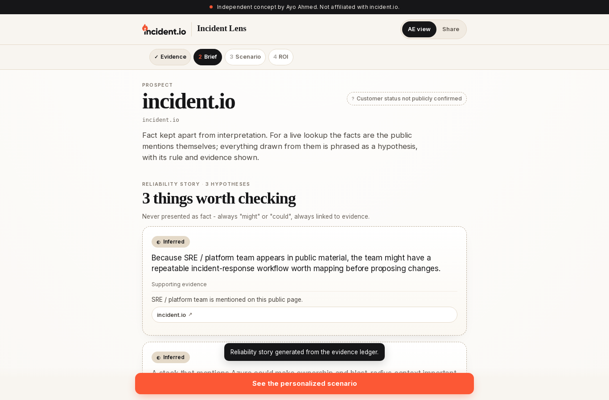
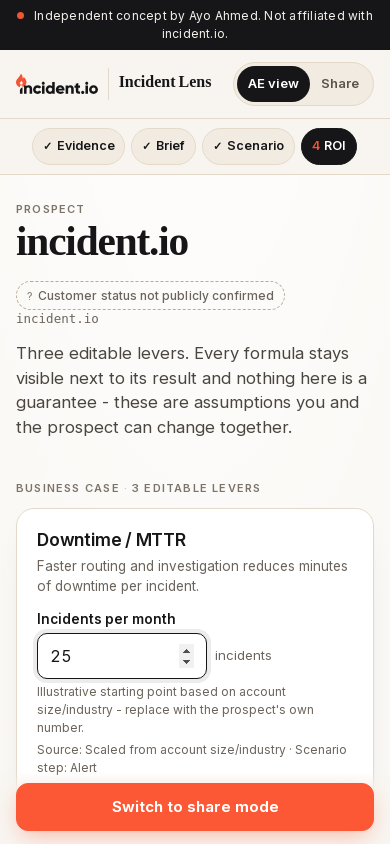

# Incident Lens

**Reliability briefs for revenue teams.** Enter a prospect's domain. Incident Lens reads that company's public pages (homepage, status page, engineering blog, careers, GitHub) and returns a dated, sourced brief that an AE, BDR, CSM or marketer can take into a call: what was observed, what might follow from it, an incident walkthrough in their stack, and an editable business case.

- **Live:** https://incident-lens-kappa.vercel.app/
- **Walkthrough video (1080×1920, about 2 min):** [docs/media/incident-lens-walkthrough.mp4](docs/media/incident-lens-walkthrough.mp4)

> Independent concept by Ayo Ahmed. Not affiliated with incident.io. The incident.io name and logo belong to incident.io and are used only to show who this concept is built around.

| Desktop | Mobile |
| --- | --- |
|  |  |
|  |  |

## What it does

1. **Evidence.** Up to nine public routes are checked. Every card on the screen is *observed*: it links to the page it came from, shows the page title and the date it was read, and quotes the page word for word. A mention with no quotable sentence is shown as a plain mention and nothing more.
2. **Brief.** Signals (status page, Kubernetes, AWS, Datadog, SRE team, and so on) become up to three hypotheses. Each one is marked *Inferred*, uses "might" or "could", and lists the evidence behind it. Below them are discovery questions and an incident.io product and integration map, with the reason for each item.
3. **Scenario.** A six-step incident in the prospect's stack: alert, routing, investigation, response, customer update, post-mortem. Steps not tied to evidence are labelled illustrative.
4. **ROI.** Three levers and seven editable assumptions, with the formula shown next to every result. The numbers are illustrative and are never presented as a promise.
5. **Share mode.** A prospect-safe view: internal notes are removed, hypotheses become questions, and sources stay. The share link carries the exact ROI values and the researched domain, so the prospect sees the same numbers the AE saw.

Three preloaded examples (Starling Bank, Monzo, Snyk) work without the network.

## Safety and honesty

- **SSRF:** only http(s) on default ports, no credentials in URLs, every redirect hop is checked again, and DNS is checked when the connection is opened, so private, loopback, link-local and metadata addresses are refused even after a DNS rebind.
- **Fail closed:** before a response is sent, `assertSourced()` checks that every observed card cites a page that was actually read, that every quote appears on that page, and that every hypothesis points to existing evidence. If any check fails, the lookup fails rather than guessing.
- **Kill switch:** live lookup is on by default. Set `LIVE_RESEARCH_ENABLED=0` to turn it off; the preloaded examples keep working.

See [docs/HONESTY-MODEL.md](docs/HONESTY-MODEL.md) and [docs/RUNBOOK.md](docs/RUNBOOK.md).

## Run it

Needs Node 20 or newer. There are no dependencies to install.

```sh
npm start            # http://localhost:3000
npm test             # node --test, 28 tests
LIVE_RESEARCH_ENABLED=0 npm start   # preloaded examples only
```

Deploys to Vercel on push to `main` (`vercel.json`).

## Docs

Product (PM package):

| | |
| --- | --- |
| [PRD](docs/PRD.md) | Problem statement, users, 5 Whys, solution, scope and non-goals, success metrics, definition of done |
| [Jobs to be done](docs/JTBD.md) | Core job, job stories, forces on switching, hiring criteria |
| [Personas](docs/PERSONAS.md) | AE, BDR, CSM, marketer, RevOps owner |
| [User stories](docs/USER-STORIES.md) | Stories with acceptance criteria and test links |
| [Service blueprint](docs/SERVICE-BLUEPRINT.md) | Front stage, back stage, systems, failure points |
| [Data dictionary](docs/DATA-DICTIONARY.md) | Every field of the evidence, signal, hypothesis, scenario, ROI, share and CRM payloads |
| [Honesty model](docs/HONESTY-MODEL.md) | Observed vs inferred vs unknown, and how it is enforced |
| [Risks](docs/RISKS.md) | Risks and mitigations |
| [Roadmap](docs/ROADMAP.md) | V2 |
| [Decision log](docs/DECISIONS.md) | Decisions and the reasons for them |
| [Rollout plan](docs/ROLLOUT.md) | Pilot, adoption, support, kill switch |
| [Viability memo](docs/VIABILITY.md) | Why this tool and why the Product Engineer - GTM role |
| [ELI5 + 30-second pitch](docs/ELI5.md) | Plain-language explanation |

Engineering and operations:

| | |
| --- | --- |
| [Design](docs/DESIGN.md) | Brand research and the visual system |
| [Test plan](docs/TEST-PLAN.md) / [Test results](docs/TEST-RESULTS.md) | What is tested, and actual runs with their numbers |
| [Runbook](docs/RUNBOOK.md) | Architecture, health checks, failure modes, debugging, rollback |
| [First 30 days as Product Engineer - GTM](docs/FIRST-30-DAYS.md) | How this tool would be owned in production |

## Limitations

This is a concept and nobody uses it yet: there are no customers, no usage data and no measured lift, and the docs do not claim any. Extraction is rule-based, so it reads only what public pages say, and some sites block automated reads. Briefs are stored only in the browser. Nothing is written to a CRM.
